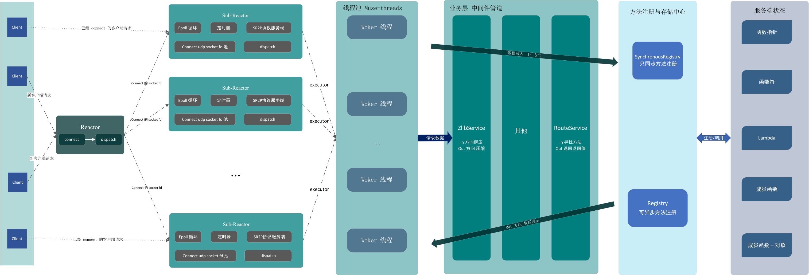

# [Muse-RPC](#)
**介绍**: 基于 Connect UDP 和自定义网络协议(简单请求响应协议) 、Reactor 网络模型(one loop per thread + 线程池) 的轻量RPC框架！

- 采用 `C++ 17` 标准内存池
- 方法绑定支持lambda、成员函数、函数符、成员函数指针
- 支持中间件配置
- 目前采用的IO复用方式是同步IO epoll 模型，仅支持 linux(后续会增加 select 以支持windows平台)。
- 支持数据压缩
- 基于UDP 可以实现网络穿透、不需要三次握手

#### 依赖库
- [zlib](https://github.com/madler/zlib)：支持多种压缩算法、应用广泛、是事实上的业界标准的压缩库，需要在机器上提前安装。
- [spdlog](https://github.com/gabime/spdlog):  一个快速、异步、线程安全、高性能的C++ (header-only) 日志库。
- [catch2](https://github.com/catchorg/Catch2) : 一个C++的开源单元测试框架，旨在提供简单、灵活和强大的测试工具。
- [muse-threads](https://github.com/sorise/muse-threads)：基于 C++ 11 标准实现的线程池！
- [muse-serializer](https://github.com/sorise/muse-serializer)：一个实现简单的二进制序列化器。
- [muse-timer](https://github.com/sorise/muse-timer) ：小型的定时器，提供了红黑树定时器和时间轮定时器。

**架构图**：




#### 配置启动
基本配置内容如下所示

```c++
int main() {
    //绑定方法的例子
    Normal normal(10, "remix"); //用户自定义类
    
    // 方法注册
    
    // 同步，意味着这个方法一次只能由一个线程执行，不能多个线程同时执行这个方法
    muse_bind_sync("normal", &Normal::addValue, &normal); //绑定成员函数
    muse_bind_async("test_fun1", test_fun1); // test_fun1、test_fun2 是函数指针
    muse_bind_async("test_fun2", test_fun2);
    
    //注册中间件
    //解压缩中间件
    MiddlewareChannel::configure<ZlibService>();
    //方法的路由，解析用户请求方法和方法参数 再注册表中寻找方法并调用
    MiddlewareChannel::configure<RouteService>(Singleton<Registry>(), Singleton<SynchronousRegistry>());
    
    //启动线程池
    GetThreadPoolSingleton();
    // 启动日志
    InitSystemLogger();
    // 开一个线程启动反应堆,等待请求
    // 绑定端口 15000， 启动两个从反应堆，每个反应堆最多维持 1500虚链接
    // ReactorRuntimeThread::Asynchronous 指定主反应堆新开一个线程运行，而不是阻塞当前线程
    Reactor reactor(15000, 2, 1500, ReactorRuntimeThread::Asynchronous);
    
    try {
        //开始运行
        reactor.start();
    }catch (const ReactorException &ex){
        SPDLOG_ERROR("Main-Reactor start failed!");
    }
    
    /*
     * 当前线程的其他任务
     * */
    
    //程序结束
    spdlog::default_logger()->flush(); //刷新日志
}
```

