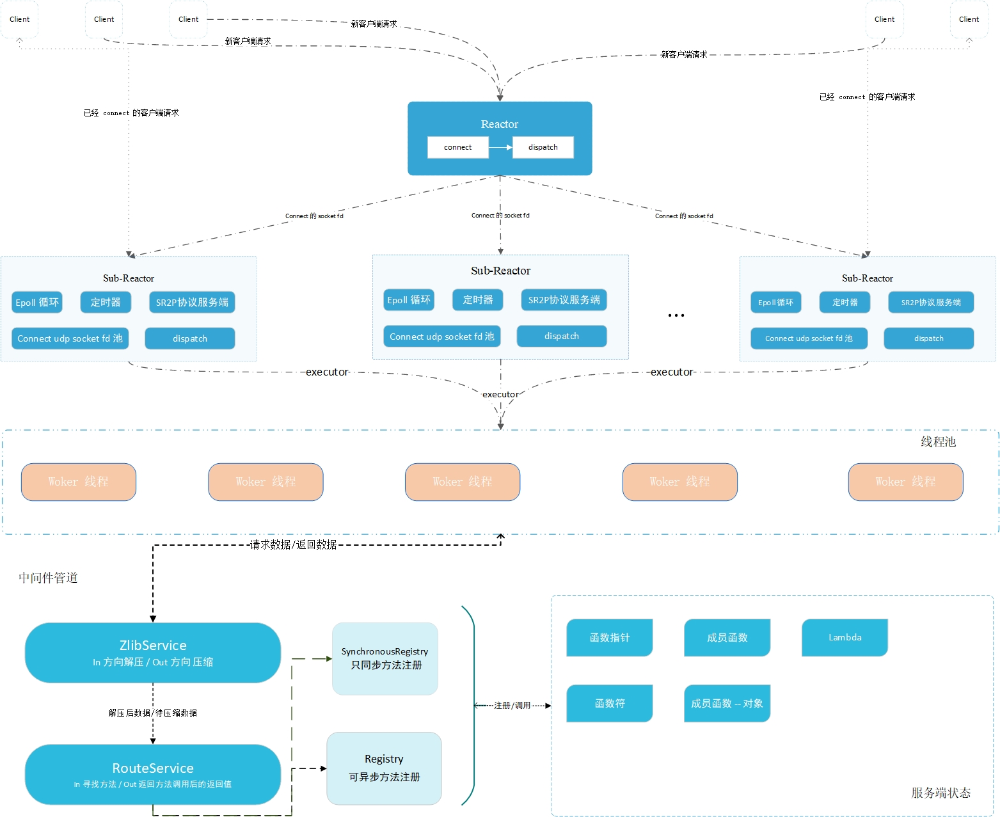
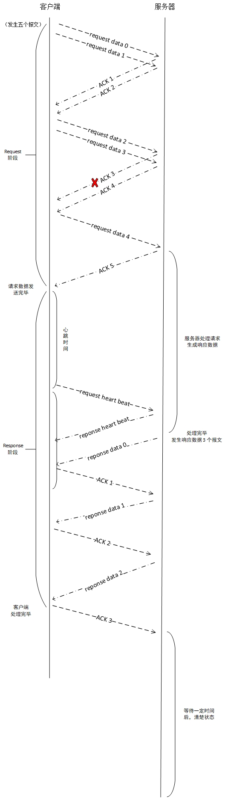

# [Muse-RPC](#)
**介绍**: 基于 Connect UDP 和自定义网络协议(简单请求响应协议) 、Reactor 网络模型(one loop per thread + 线程池) 的轻量RPC框架！

- 采用 `C++ 17` 标准内存池
- 方法绑定支持lambda、成员函数、函数符、成员函数指针
- 支持中间件配置、支持数据压缩、自定义中间件
- 目前采用的IO复用方式是同步IO epoll 模型，仅支持 linux(后续会增加 select 以支持windows平台)。
- 简单请求响应协议（Simple Request-Response Protocol）在UDP的基础上提供了ACK确认、请求重传、重组排序、心跳功能！
- 客户端支持阻塞RPC请求和基于回调的非阻塞RPC请求


**目前使用方法**：

```shell
# 需要提前安装zlib库
# 本人开发环境  GCC 11.3  CMake 3.25 clion ubuntu 22.04
git clone git@github.com:sorise/muse-rpc.git
cd muse-rpc
cmake -S . -B build
cmake --build 
cd build
./muse   #启动
```

#### 依赖库
- [zlib](https://github.com/madler/zlib)：支持多种压缩算法、应用广泛、是事实上的业界标准的压缩库，需要在机器上提前安装。
- [spdlog](https://github.com/gabime/spdlog):  一个快速、异步、线程安全、高性能的C++ (header-only) 日志库。
- [catch2](https://github.com/catchorg/Catch2) : 一个C++的开源单元测试框架，旨在提供简单、灵活和强大的测试工具。
- [muse-threads](https://github.com/sorise/muse-threads)：基于 C++ 11 标准实现的线程池！
- [muse-serializer](https://github.com/sorise/muse-serializer)：一个实现简单的二进制序列化器。
- [muse-timer](https://github.com/sorise/muse-timer) ：小型的定时器，提供了红黑树定时器和时间轮定时器。

**架构图**：



### 1. 基本使用方法

#### 1.1 服务端配置启动

基本配置内容如下所示

```c++
int main() {
    //绑定方法的例子
    Normal normal(10, "remix"); //用户自定义类
    
    // 方法注册
    
    // 同步，意味着这个方法一次只能由一个线程执行，不能多个线程同时执行这个方法
    muse_bind_sync("normal", &Normal::addValue, &normal); //绑定成员函数
    muse_bind_async("test_fun1", test_fun1); // test_fun1、test_fun2 是函数指针
    muse_bind_async("test_fun2", test_fun2);
    
    //注册中间件
    //解压缩中间件
    MiddlewareChannel::configure<ZlibService>();
    //方法的路由，解析用户请求方法和方法参数 再注册表中寻找方法并调用
    MiddlewareChannel::configure<RouteService>(Singleton<Registry>(), Singleton<SynchronousRegistry>());
    
    //启动线程池
    GetThreadPoolSingleton();
    // 启动日志
    InitSystemLogger();
    // 开一个线程启动反应堆,等待请求
    // 绑定端口 15000， 启动两个从反应堆，每个反应堆最多维持 1500虚链接
    // ReactorRuntimeThread::Asynchronous 指定主反应堆新开一个线程运行，而不是阻塞当前线程
    Reactor reactor(15000, 2, 1500, ReactorRuntimeThread::Asynchronous);
    
    try {
        //开始运行
        reactor.start();
    }catch (const ReactorException &ex){
        SPDLOG_ERROR("Main-Reactor start failed!");
    }
    
    /*
     * 当前线程的其他任务
     * */
    
    //程序结束
    spdlog::default_logger()->flush(); //刷新日志
}
```

启动后：


#### 1.2 Server 注册方法
使用宏 **muse_bind_sync** 和 **muse_bind_async**。前者是调用 SynchronousRegistry  后者是调用 Registry ,原型如下所示。

```cpp
#include <iostream>
#include "rpc/rpc.hpp"

using namespace muse::rpc;
using namespace muse::pool;
using namespace std::chrono_literals;

//绑定方法的例子
Normal normal(10, "remix");

// 绑定类的成员函数、使用 只同步方法 绑定
muse_bind_sync("normal", &Normal::addValue, &normal);
// 绑定函数指针
muse_bind_async("test_fun1", test_fun1);
// 绑定 lambda 表达式
muse_bind_async("lambda test", [](int val)->int{
    printf("why call me \n");
    return 10 + val;
});
```

在服务端注册方法需要使用到 Registry 和 SynchronousRegistry 对象，

* Registry 是可异步方法注册器，**意思是这个方法可以因为多个客户端请求而同时调用**。
* SynchronousRegistry 是只同步方法注册器，一般用于成员函数，如果有多个客户端请求调用这个方法，那么它们只能依次调用，**作用**：如果我们有一个成员函数可以访问对象成员的一个计数器。

SynchronousRegistry 解释：value 是一个用于记录有多少客户端请求了 addValue方法的字段，如果1000个客户端请求了 addValue，采用Registry 注册，value的值可能不是1000，因为对 value的访问不是线程安全的，如果采用 SynchronousRegistry 注册，则一定是 1000。

```cpp
class Counter{
public:
    Counter():value(0){}

    void addValue(){
        this->value++;
    }
private:
    long value;
};
```

**注册方法** ： 两个宏的定义如下所示
```cpp
#define muse_bind_async(...) \
    Singleton<Registry>()->Bind(__VA_ARGS__);

//同步方法，一次只能一个线程执行此方法
#define muse_bind_sync(...) \
    Singleton<SynchronousRegistry>()->Bind(__VA_ARGS__);
```

#### 1.3 客户端阻塞请求
客户端使用 Client 对象，它会返回一个 **Outcome\<R\>** 对象 ，isOK方法将指示是否返回成功！如果返回false，其成员protocolReason将指示是否是网络出现异常，response成员将会指示是否是rpc请求，响应错误。

```cpp
#include "rpc/rpc.hpp"
#include "rpc/client/client.hpp"

using namespace muse::rpc;
using namespace muse::timer;
using namespace std::chrono_literals;

int main{
    //注册中间件
    MiddlewareChannel::configure<ZlibService>();  //解压缩
    MiddlewareChannel::configure<RouteService>(
            Singleton<Registry>(), Singleton<SynchronousRegistry>()
    ); //方法的路由
    //MemoryPoolSingleton 返回一个 std::shared_ptr<std::pmr::synchronized_pool_resource>
    //你可以自己定一个内存池
    
    //传入 服务器地址和服务端端口号、一个C++ 17 标准内存池
    Client client("127.0.0.1", 15000, MemoryPoolSingleton());
    
    //调用远程方法
    outcome<std::vector<double>> result = remix.call<std::vector<double>>("test_fun2",scores);
    
    std::cout << result.value.size() << std::endl;
    
    //调用 无参无返回值方法
    outcome<void> result =remix.call<void>("normal");
    if (result.isOK()){
        std::printf("success\n");
    }else{
        std::printf("failed\n");
    }
    
    //调用
    auto ri = remix.call<int>("test_fun1", 590);
    
    std::cout << ri.value << std::endl; // 600
};


```

**错误处理：** 正常情况下你只需要关注 isOk方法是否为真即可，如果你需要知道错误的细节，那么可以采用如下方法，两个枚举对象FailureReason和RpcFailureReason分别指出网络错误和RPC请求错误。

```cpp
auto resp = remix.call<int>("test_fun1", 590);

if (resp.isOK()){
    //调用成功
    std::cout <<"request success\n" << std::endl; // 600
    std::cout << ri.value << std::endl; // 600
}else{
	//调用失败
    if (resp.protocolReason == FailureReason::OK){
      	//错误原因是RPC错误
        std::printf("rpc error\n");
        std::cout << resp.response.getReason() << std::endl; 
        //返回 int 值对应 枚举 RpcFailureReason
    }else{
      	//错误原因是网络通信过程中的错误        
        std::printf("internet error\n");
        std::cout << (short)resp.protocolReason << std::endl; //错误原因
    }
}

//resp.protocolReason() 返回 枚举FailureReason 
enum class FailureReason: short {
    OK, //没有失败
    TheServerResourcesExhausted, //服务器资源耗尽，请勿链接
    NetworkTimeout, //网络连接超时
    TheRunningLogicOfTheServerIncorrect, //服务器运行逻辑错误，返回的报文并非所需
};

//resp.response.getReason() 返回值 是 int
enum class RpcFailureReason:int{
    Success = 0, // 成功
    ParameterError = 1, // 参数错误,
    MethodNotExist = 2, // 指定方法不存在
    ClientInnerException = 3, // 客户端内部异常，请求还没有到服务器
    ServerInnerException = 4, // 服务器内部异常，请求到服务器了，但是处理过程有异常
    MethodExecutionError = 5, // 方法执行错误
    UnexpectedReturnValue = 6, //返回值非预期
};
```

#### 1.4 客户端非阻塞请求
非阻塞请求的意思是你只需设定好请求任务，注册一个回调函数用于处理请求结果即可，发送过程由Transmitter对象来处理，这样就不会因为网络原因和处理过程阻塞当前线程，
非阻塞将会基于回调来处理，可以用于处理大量请求的情况，这里我们需要一个 Transmitter 对象、发送任务通过TransmitterEvent来设置！

```cpp
void test_v(){
    //注册中间件
    MiddlewareChannel::configure<ZlibService>();  //解压缩
    MiddlewareChannel::configure<RouteService>(
            Singleton<Registry>(), Singleton<SynchronousRegistry>()
    ); //方法的路由

    Transmitter transmitter(14500, GetThreadPoolSingleton());
    
    //测试参数
    std::vector<double> score = {
            100.526,95.84,75.86,99.515,6315.484,944.5,98.2,99898.26,9645.54,484.1456,8974.4654,4894.156,
            89,12,0.56,95.56,41
    };

    std::string name {
        "asdasd54986198456h487s1as8d7as5d1w877y98j34512g98adsf3488as31c98a"
    };
    
    for (int i = 0; i < 1000; ++i) {
        TransmitterEvent event("127.0.0.1", 15000); //指定远程IP 、Port
        event.call<int>("read_str", name,score);    //指定方法
        event.set_callBack([](Outcome<int> t){      //设置回调
            if (t.isOK()){
                printf("OK lambda %d \n", t.value);
            }else{
                printf("fail lambda\n");
            }
        });
        transmitter.send(std::move(event));
    }
    //异步启动发射器，将会新开一个线程持续发送
    transmitter.start(TransmitterThreadType::Asynchronous);
    
    //停止发射器，这是个阻塞方法，如果发送器还有任务没有处理完，将会等待
    transmitter.stop();
    //如果想直接停止可以使用 transmitter.stop_immediately()方法
}
```

### [2. 网络协议：Simple Request-Response Protocol](#)
**介绍**：简单请求响应协议（SR2P 协议），是一种两阶段协议，专门为 RPC 定制，分为请求和响应两个阶段不需要建立链接。

协议字段如下所示，协议头是26字节，字段字节序采用大端序，数据部分是小端序，由于MTU的限制，网络标准MTU为576，数据部分最大为522字节，更多请看 [Protocol.md](./docs/Protocol.md)。


* **synchronousWord**    同步字 , 值为`11110000`，一个字节。
* **type** 协议类型
* **CommunicationPhase**  协议阶段，4位
  * Request 阶段 0
  * Response 阶段 1
* **ProtocolType** 4位
  * RequestSend ,   纯数据报文
  * ReceiverACK , 接收方确认ACK
  * RequestACK ，请求ACK 确认
  * TimedOutRequestHeartbeat  心跳请求，报文还在处理吗
  * TimedOutResponseHeartbeat  心跳响应
  * UnsupportedNetworkProtocol 网络数据格式不正确
  * StateReset  没有这个报文记录，这是过期数据
  * TheServerResourcesExhausted  服务器资源已经耗尽
* **pieceOrder** 分片序号，2个字节
* **pieceSize** 总共有多少个分片 ，2个字节
* **acceptMinOrder**  发送数据端希望收到的确认号 **暂未使用**，2个字节
* **timePoint** **时间戳**，唯一确定一个完整报文，表示当前数据属于哪一个报文，和客户端IP/端口号 存储在服务器，唯一确定一个用户请求。
* **totalCount** 总共有多少个分片  2个字节
* **pieceStandardSize**  一个标准分片的大小 2个字节
* **totalSize**  完整报文的大小   4个字节
* **acceptOrder** 确认序号  2个字节


SR2P协议会根据发生数据的多少决定每次发生几个数据报，下面以一次2个为例，在基本正常情况下的请求流程图：



其他情况的处理过程详细请查看 [Protocol.md](./docs/Protocol.md) 文档

### [3. 致谢](#)
* 感谢 valgrind 工具在问题排查中的大力支持