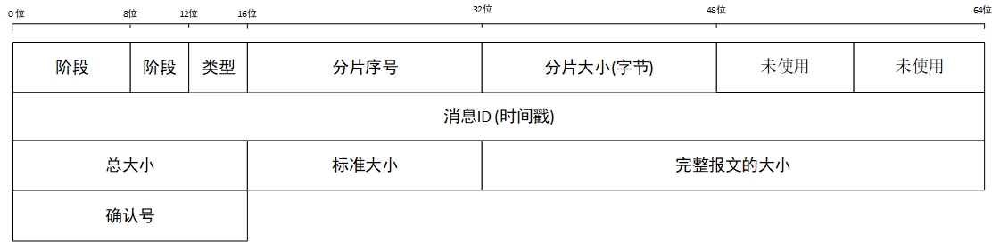

### [Simple Request-Response Protocol](#)
**介绍**：简单请求响应协议，SR2P 协议！

----

### [一、协议字段及其意义](#)
协议可视化内容



```cpp
//协议头 结构体
struct ProtocolHeader{
    // 八 字节
    uint8_t synchronousWord;          // 1 同步字  全1111 0000
    CommunicationPhase phase;          // 1 协议阶段
    ProtocolType type;                // 1 协议类型
    uint16_t pieceOrder;              // 2 序号
    uint16_t pieceSize;               // 2 当前分片的数据部分有多少个字节
    uint16_t acceptMinOrder;          // 2 发送数据端希望收到的确认号
    // 八 字节
    uint64_t timePoint;               // 8 区分不同的包 报文 ID
    // 八 字节
    uint16_t totalCount;                   // 2 总共有多少个包
    uint16_t pieceStandardSize ;      // 2 标准大小
    uint32_t totalSize;               // 4 UDP完整报文的大小
    // 二 字节
    uint16_t acceptOrder;             // 2 确认序号
};
```

```cpp
enum class ProtocolType:unsigned char{
    RequestSend = 0,                    // 纯数据报文 totalSize 是真实数据大小
    ReceiverACK = 2,                    // 接收方确认数据  totalSize = 0
    RequestACK = 3,                     // 确认 ACK  关心阶段 totalSize = 0
    TimedOutRequestHeartbeat = 4,       // 心跳请求  表示当前的报文生命周期还在吗 totalSize = 0
    TimedOutResponseHeartbeat = 5,      // 心跳响应  表示正在处理 totalSize = 0
    UnsupportedNetworkProtocol = 6,     // 网络数据格式不正确 只会服务器发送 totalSize = 0
    StateReset = 7,                     // 链接已经重置了,或者服务器没有这个链接 totalSize = 0
    TheServerResourcesExhausted = 8,    // 服务器资源已经耗尽, 只会服务器发送 totalSize = 0
    Terminate = 9,                      // 响应结束 ？？？  totalSize = 0
};

enum class CommunicationPhase:uint8_t {
    Request = 0,
    Response = 1
};
```


Request阶段：**client 向 server 发送请求数据**

| 阶段      | client(发送方)              | server(接收方)                 |
|:---------|:-------------------------|:----------------------------|
| Request  | RequestSend              | ReceiverACK                 |
|          | RequestACK               | ReceiverACK                 |
|          | TimedOutRequestHeartbeat | TimedOutResponseHeartbeat   |
|          | 正常数据                     | TheServerResourcesExhausted |
|          | 非法数据                     | UnsupportedNetworkProtocol  |
|          | 超时重置                     | StateReset                  |

Response阶段：**server 向 client 发送响应数据**

| 阶段      | server(发送方)             | client(接收方)             |
|:---------|:--------------------------|:--------------------------|
| Response | RequestSend               | ReceiverACK               |
|          | RequestACK                | ReceiverACK               |
|          | TimedOutRequestHeartbeat  | TimedOutResponseHeartbeat |
|          | TimedOutResponseHeartbeat | TimedOutRequestHeartbeat  |
|          | RequestSend | TimedOutRequestHeartbeat  |
|          | 发送完毕                      | StateReset                |

### [2. 交互过程](#)
前向声明的类或者结构体只能用来定义指针或者引用。
